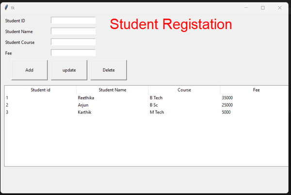

# Student Data Register

It is a Python GUI Student Data Register App built with MySQL Database integration.


## Tech

Python, Tkinter, MySQL

## Screenshots



## Run Locally


### STEPS:

1. Clone the repository

```bash
https://github.com/Reethika12/studentRegistration.git
```

2. Create a MySQL Database  
Table : registation
```
# Table : registation
Columns:
studid int 
studname varchar(45) 
coursename varchar(45) 
feee int
```
3. Create a Virtual Environment and activate it
```
python -m venv env
```

```bash
.\env\Scripts\activate
```

4. Install requirements

```bash
pip install mysql-connector-python
```
5. Finally run the main.py file

```bash
python main.py
```

